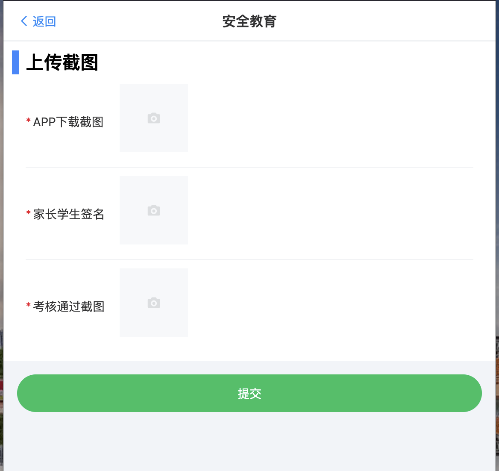

# 2026杭电保卫公众号「研新·序章」始业教育答题工具 

根据学校通知：新生安全教育学习时间推迟到9月9日，考试次数增加了3次

## 最简单的用法

把下面的 prompt 丢给 **Claude Code** 、 **Codex** 或者  **Workbuddy**：

```text
帮我安装并运行这个项目，完成后打开本地网页：
https://github.com/yuaiccc/HDU-xiaoyuananquantong
```


## 使用

1. 在「杭电保卫」公众号中进入「服务师生 → 新生安全 → 学习课程」。
2. 在浏览器菜单中选择「复制链接」。
3. 把链接粘贴到工具网页，点击「开始答题并获取证书」。
4. 完成后登录「杭电研究生-i学工」一站式平台，在「安全教育」中上传 APP 下载截图、家长学生签名截图和考核通过截图，最后点击「提交」。




工具会跳过已完成课程，完成剩余章节和考试，并展示证书。`ah` 过期时，重新登录平台并复制链接即可。

> 目前仅面向杭州电子科技大学，其他学校题库情况未知。

## ⚠️

本项目仅供学习与技术交流。请自行确认学校是否允许使用自动化工具，并对使用后果负责。
