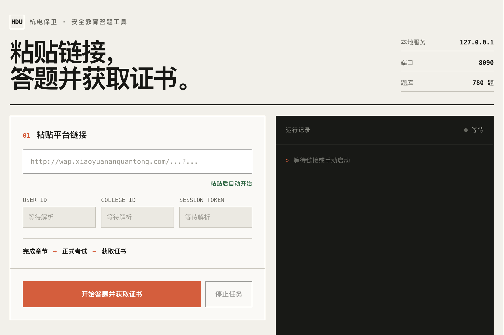
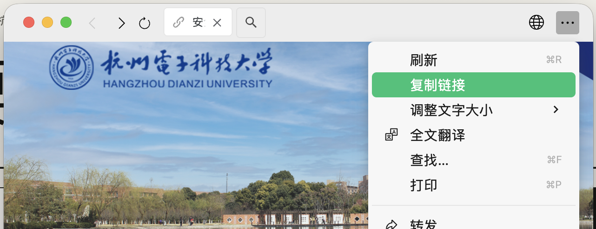

# 杭电保卫公众号「研新·序章」始业教育自动答题工具

## 最简单的用法

把本仓库链接丢给 **Claude Code** 或 **Codex**，发送：

```text
帮我安装并运行这个项目，完成后打开本地网页：
https://github.com/yuaiccc/HDU-xiaoyuananquantong
```

> 只需把仓库链接发给 Agent。平台登录链接和 `ah` token 请勿发到聊天中，在打开的本地网页里粘贴即可。

## 直接运行

macOS / Linux：

```bash
curl -fsSL https://raw.githubusercontent.com/yuaiccc/HDU-xiaoyuananquantong/main/install.sh | bash
```

Windows PowerShell：

```powershell
irm https://raw.githubusercontent.com/yuaiccc/HDU-xiaoyuananquantong/main/install.ps1 | iex
```

服务只在 `127.0.0.1` 本地运行，不会持久化保存 `ah` token。

## 使用

1. 在「杭电保卫」公众号中进入「服务师生 → 新生安全 → 学习课程」。
2. 在浏览器菜单中选择「复制链接」。
3. 把链接粘贴到工具网页，点击「开始答题并获取证书」。





工具会跳过已完成课程，完成剩余章节和考试，并展示证书。`ah` 过期时，重新登录平台并复制链接即可。

> 目前仅面向杭州电子科技大学，其他学校题库情况未知。

## ⚠️

本项目仅供学习与技术交流。请自行确认学校是否允许使用自动化工具，并对使用后果负责。
